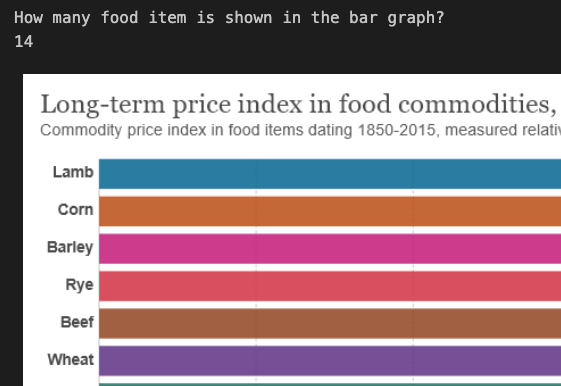
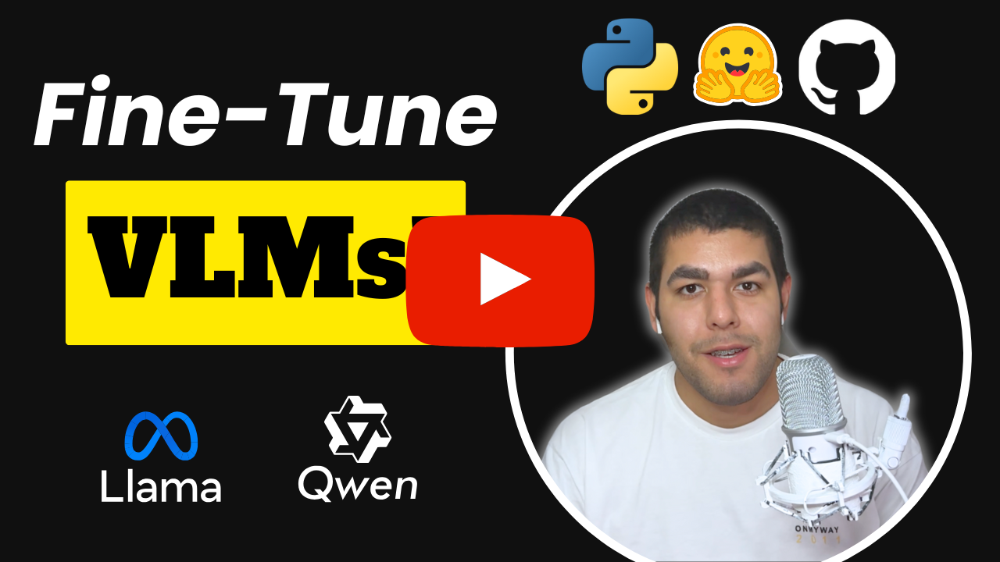

# Instruct-Tune TinyLlama

    
    

    

 

    
Liked our work? give us a ⭐!

  

This repository contains an easy-to-use and understand code to fine-tune VLMs (Visual Language Models). In this case, we'll be fine tuning [Qwen/Qwen2-VL-7B-Instruct](https://huggingface.co/Qwen/Qwen2-VL-7B-Instruct). Refer to the `fine-tune-vlms-qwen.ipynb` file.

## YouTube Tutorial

    <a href="https://youtu.be/6XeTk8cZUsM">Fine-Tune Visual Language Models (VLMs) - HuggingFace, PyTorch</a>
     
     
    

### References
- https://huggingface.co/learn/cookbook/en/fine_tuning_vlm_trl
- https://huggingface.co/docs/trl/en/sft_trainer
- https://huggingface.co/docs/transformers/main/en/tasks/visual_question_answering
- https://huggingface.co/Qwen/Qwen2-VL-7B-Instruct